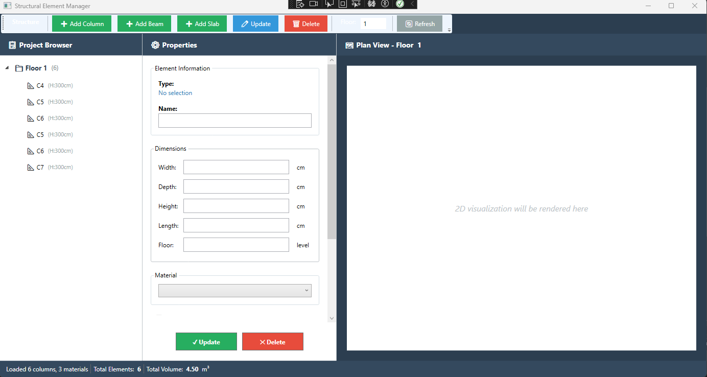
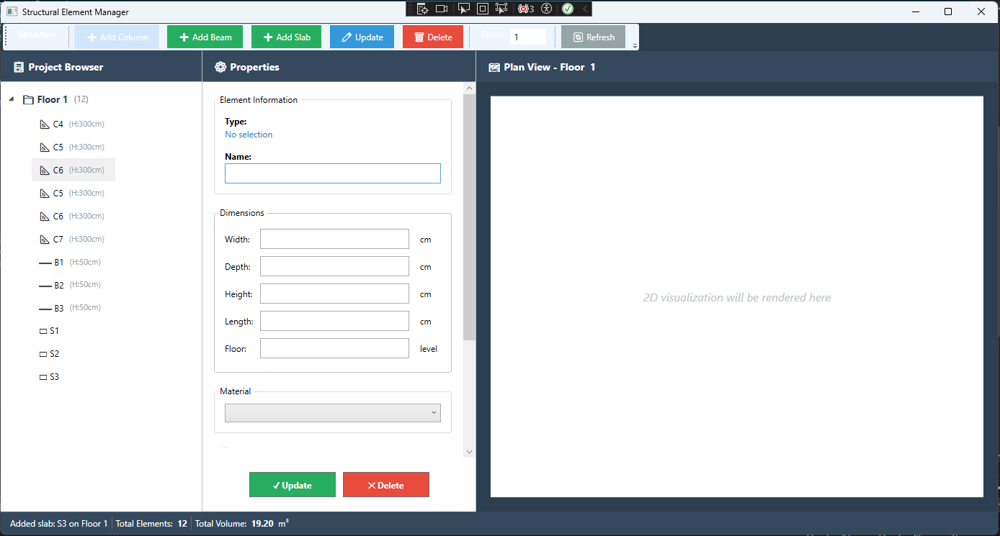
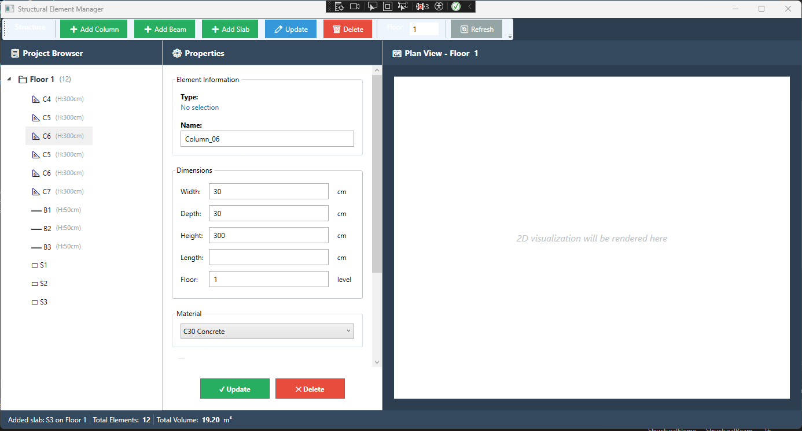

# 🏗️ Structural Element Manager

### BIM-Inspired Engineering Software | Clean Architecture | My First Desktop Application Journey

[](https://dotnet.microsoft.com/)
[](https://docs.microsoft.com/en-us/dotnet/desktop/wpf/)
[](https://www.microsoft.com/sql-server)
[](https://docs.microsoft.com/en-us/ef/core/)
[]()


> **Note:** This is Version 1 of my first BIM-inspired desktop application. While functional and demonstrating core concepts, this project contains architectural decisions I later identified as improvable. See [Lessons Learned](#-lessons-learned--architectural-evolution) section for details and the improved [Version 2: StructuralDesignStudio](https://github.com/mrvekratl/StructuralDesignStudio).

---

## 📌 About This Project

**Structural Element Manager** is my **first attempt** at building a BIM-inspired structural element management system, bridging my background in **architecture and BIM** with **enterprise software development principles**.

This project represents a critical learning milestone in my transition from architecture to software development. It demonstrates:

✅ **What I Built Successfully:**
- Functional Revit-style 3-column UI
- Working CRUD operations for structural elements
- Parametric calculations (volume, weight)
- Clean Architecture layers (Entity, DAL, Business, UI)
- Generic Repository and Service patterns
- TPH (Table Per Hierarchy) database strategy

⚠️ **What I Learned to Improve:**
- Dependency Injection implementation
- ViewModel-Service layer separation
- DTO usage for presentation layer
- MVVM best practices
- View organization and reusability

---

## 🎯 Project Goals

### Primary Objective
Demonstrate how **architectural domain knowledge** translates into software architecture decisions, particularly for companies building **engineering-focused applications**.

### Learning Objectives (Achieved)
1. ✅ Build a working WPF desktop application
2. ✅ Implement Clean Architecture principles
3. ✅ Use Generic patterns to reduce code duplication
4. ✅ Apply MVVM pattern for UI development
5. ✅ Model BIM concepts as code structures
6. ⚠️ Identify and document architectural improvements (see V2)

---

## 🛠️ Screenshots

### Main Interface — Revit-Inspired Layout


*Three-column professional layout: Project Browser, Properties Panel, and Plan View*

### Project Browser — Hierarchical Organization

*Floor-based tree structure with element type indicators*

### Properties Panel — Real-Time Editing

*Parametric dimension editing with automatic calculations*

---

## 🏗️ Architecture Overview
```
┌─────────────────────────────────────────────┐
│   Presentation Layer (WPF + MVVM)          │
│   └─ MainViewModel (⚠️ needs refactoring)  │
├─────────────────────────────────────────────┤
│   Business Layer (Generic Service)         │
│   └─ StructuralColumnManager, etc.         │
├─────────────────────────────────────────────┤
│   Data Access Layer (Generic Repository)   │
│   └─ EfStructuralColumnDal, etc.           │
├─────────────────────────────────────────────┤
│   Entity Layer (Domain Models)             │
│   └─ StructuralElement (abstract base)     │
└─────────────────────────────────────────────┘
```

### What Works Well ✅

**1. Domain-Driven Design**
```csharp
public abstract class StructuralElement
{
    public abstract double CalculateVolume();
    public abstract double CalculateWeight();
}

public class StructuralColumn : StructuralElement
{
    public override double CalculateVolume()
    {
        return (Width * Depth * Height) / 1_000_000; // m³
    }
}
```
**Why it's good:** Calculations belong in domain models, reflecting real BIM workflows.

---

**2. Generic Repository Pattern**
```csharp
public interface IGenericDal where T : class
{
    void Insert(T entity);
    List GetList();
    // ... other CRUD operations
}
```
**Impact:** Reduced code duplication by ~60% compared to individual repositories.

---

**3. TPH (Table Per Hierarchy) Strategy**

**Decision:** Single table for all structural elements with discriminator column.

**Why TPH?** Mirrors how professional BIM software (Autodesk Revit, Tekla) handles elements:
```sql
-- Single query, no joins
SELECT * FROM StructuralElements WHERE FloorLevel = 1;
```

**Benefits:**
- ✅ Performance for "all elements on Floor X" queries
- ✅ Simpler polymorphic operations
- ✅ Industry-standard approach

---
## ⚠️ Lessons Learned & Architectural Evolution

### Critical Issues Identified (Post-Development Analysis)

#### 🔴 **Issue 1: ViewModel Knows Database Layer**

**Current Implementation (V1):**
```csharp
public class MainViewModel : ObservableObject
{
    public MainViewModel()
    {
        // ❌ Direct instantiation of DAL classes
        _columnService = new StructuralColumnManager(new EfStructuralColumnDal());
        _materialService = new StructuralMaterialManager(new EfStructuralMaterialDal());
    }
}
```

**Problems:**
- 🚫 ViewModel directly depends on concrete DAL classes
- 🚫 Violates Dependency Inversion Principle
- 🚫 Impossible to unit test without real database
- 🚫 Can't swap implementations (e.g., mock for testing)


#### 🔴 **Issue 2: ViewModel Overloaded with Responsibilities**

**Current MainViewModel handles:**
- ✅ Data loading
- ✅ CRUD operations
- ✅ Statistics calculations
- ✅ UI state management
- ✅ Floor logic
- ✅ Element selection
- ✅ Material management

**Problem:** Violates **Single Responsibility Principle** (SRP)

**Impact:**
- 🚫 ~500 lines in one file
- 🚫 Hard to test individual concerns
- 🚫 Changes to statistics logic affect CRUD logic
- 🚫 Can't reuse floor logic elsewhere


#### 🔴 **Issue 3: DTO Layer Created But Unused**

**Current:**
```
DtoLayer/
├── ColumnDto/  (empty)
├── BeamDto/    (empty)
└── SlabDto/    (empty)
```

**What's happening:**
```csharp
// ❌ Using domain entities directly in UI
public ObservableCollection Columns { get; set; }
```

**Problems:**
- 🚫 Business logic exposed to UI layer
- 🚫 Database schema changes break UI
- 🚫 Can't add UI-specific properties (e.g., `IsSelected`, `DisplayName`)
- 🚫 Security risk if extended to Web API


#### 🔴 **Issue 4: UI Concerns in ViewModel**

**Current:**
```csharp
// ❌ In MainViewModel.cs
public void DrawFloorPlan()
{
    // Canvas drawing logic here
}
```

**Problem:** ViewModel shouldn't know about `Canvas`, `Rectangle`, or any WPF visual elements.

#### 🟡 **Issue 5: View Organization**

**Current Structure:**
```
UI/
├── MainWindow.xaml         (everything here)
├── Views/                  (empty)
├── Resources/              (empty)
└── Helpers/
    └── CanvasDrawer.cs     (created but not used)
```

**Problem:** Not scalable. Adding new views means cluttering MainWindow.


### 📊 Impact Analysis

| **Metric** | **V1 (Current)** | **V2 (Improved)** | **Benefit** |
|-----------|-----------------|------------------|-------------|
| **Testability** | Low (DB required) | High (mockable) | Unit tests without infrastructure |
| **ViewModel Size** | ~500 lines | ~150 lines each | Maintainable, focused classes |
| **Coupling** | Tight (DAL→UI) | Loose (DI) | Easy to modify layers independently |
| **DTO Usage** | 0% | 100% | API-ready, secure |
| **View Reusability** | None | High | UserControls reusable across windows |

---

## 🎓 What This Project Taught Me

### Technical Skills Gained ✅
1. **WPF & XAML** — Desktop UI development
2. **MVVM Pattern** — Separation of concerns (with room to improve)
3. **EF Core Migrations** — Database schema management
4. **Generic Patterns** — Repository and Service abstractions
5. **ObservableCollection** — Reactive UI updates
6. **Data Binding** — Two-way communication between UI and logic

### Architectural Insights 💡
1. **Dependency Injection** — Critical for testability and flexibility
2. **SRP (Single Responsibility)** — Large classes = maintenance nightmare
3. **DTO Benefits** — Layer isolation and security
4. **MVVM Best Practices** — ViewModels should be view-agnostic
5. **Pragmatic Development** — V1 works → identify issues → build V2

---

## 🚀 Version 2: StructuralDesignStudio

Based on the lessons learned from this project, I'm building an **improved version** that addresses all identified issues:

### V2 Architecture Improvements

| **Category** | **V1 Approach** | **V2 Approach** |
|-------------|-----------------|----------------|
| **Dependency Management** | Manual instantiation | Microsoft.Extensions.DI container |
| **Service Layer** | Concrete classes | Interface abstractions (IElementService) |
| **DTO Implementation** | Unused | Full DTO layer with AutoMapper |
| **ViewModel Design** | Single large VM | Multiple focused VMs |
| **View Structure** | Monolithic XAML | Modular UserControls |
| **Drawing Logic** | In ViewModel | Separate DrawingService |
| **Unit Tests** | None | xUnit + Moq for all layers |

### V2 Feature Additions

✅ **3D Canvas Rendering** — Fully functional floor plan visualization  
✅ **Advanced Filtering** — Search by type, material, dimensions  
✅ **Beam & Slab Full Support** — Complete implementation  
✅ **User Preferences** — Save/load UI state  

**Repository:** [StructuralDesignStudio](https://github.com/mrvekratl/StructuralDesignStudio) *(In development)*

---

## 🎯 For Recruiters & Engineering Software Companies

### Why This Repository Matters

This project demonstrates **two critical developer qualities**:

**1. Delivery Capability** ✅  
- Built a functional BIM-inspired application from scratch
- Implemented complex domain logic (parametric calculations)
- Created professional Revit-style UI
- Used modern technologies (.NET 8, WPF, EF Core)

**2. Growth Mindset** 📈  
- Self-identified architectural flaws
- Researched best practices (DI, DTO, SRP)
- Documented learnings transparently
- Building improved V2 with enterprise patterns

### Why Both Versions Are Valuable

**Version 1 (This Project):**
- Shows I can **deliver working software quickly**
- Demonstrates **domain knowledge** (BIM, engineering workflows)
- Proves **functional programming skills**

**Version 2 (StructuralDesignStudio):**
- Shows I understand **enterprise architecture**
- Demonstrates **production-ready code quality**
- Proves **continuous improvement mindset**

### Ideal For Companies 

If you're building engineering-focused applications where:
- ✅ Domain expertise matters (BIM, CAD, structural analysis)
- ✅ Clean architecture is critical for long-term maintenance
- ✅ Developers who learn from mistakes are valued
- ✅ Iterative improvement is part of the culture

**I'm your ideal candidate.**

---

## 💻 Technical Stack

| **Category** | **Technologies** |
|-------------|-----------------|
| **Framework** | .NET 8.0, C# 12 |
| **UI** | WPF, XAML, CommunityToolkit.Mvvm |
| **Database** | SQL Server, Entity Framework Core 8.0 |
| **Patterns** | Generic Repository, Generic Service, MVVM, Clean Architecture |
| **Validation** | FluentValidation |
| **Tools** | Visual Studio 2022, SSMS, Git |

---

## 📂 Project Structure
```
StructuralElementManager/
├── StructuralElementManager.EntityLayer/
│   └── Concrete/
│       ├── StructuralElement.cs (abstract base)
│       ├── StructuralColumn.cs
│       ├── StructuralBeam.cs
│       ├── StructuralSlab.cs
│       └── StructuralMaterial.cs
├── StructuralElementManager.DataAccessLayer/
│   ├── Abstract/ (Generic & specific interfaces)
│   ├── Concrete/Context/ (DbContext, TPH configuration)
│   ├── EntityFramework/ (Repository implementations)
│   └── Repository/ (GenericRepository base)
├── StructuralElementManager.BusinessLayer/
│   ├── Abstract/ (Service interfaces)
│   ├── Concrete/ (Service implementations)
│   └── ValidationRules/ (FluentValidation - minimal)
├── StructuralElementManager.DtoLayer/
│   └── (⚠️ Created but unused - planned for V2)
└── StructuralElementManager.UI/
    ├── ViewModels/ (⚠️ MainViewModel needs refactoring)
    ├── Models/ (UI-specific models)
    ├── Helpers/ (Converters, utilities)
    ├── Views/ (⚠️ Empty - should contain UserControls)
    └── Resources/ (⚠️ Empty - should contain Styles)
```

---

## 🚀 Getting Started

### Prerequisites
- .NET 8.0 SDK
- SQL Server (LocalDB, Express, or Full)
- Visual Studio 2022


## ✨ Key Features (Working)

### Structural Element Management
- ✅ Add/Edit/Delete Columns, Beams, Slabs
- ✅ Parametric dimensions (Width, Depth, Height, Length)
- ✅ Material assignment (C30/C35 Concrete, S420/S500 Steel)
- ✅ Floor-based organization

### Calculations
- ✅ Automatic volume calculation (m³)
- ✅ Weight calculation (tons) based on material density
- ✅ Floor-level statistics (total count, volume)

### User Interface
- ✅ Revit-inspired 3-column layout
- ✅ Hierarchical Project Browser (Floors → Elements)
- ✅ Properties Panel with real-time editing
- ✅ Status bar with live statistics
- ⚠️ Plan View (placeholder - full rendering in V2)

---

## 🔮 Known Limitations & Future Work

### Current Limitations
- ⚠️ No Dependency Injection container
- ⚠️ ViewModel directly instantiates services
- ⚠️ DTO layer unused
- ⚠️ No unit tests
- ⚠️ 2D Canvas not implemented
- ⚠️ Single large ViewModel

### Planned for V2 (StructuralDesignStudio)
- [ ] Full Dependency Injection (Microsoft.Extensions.DI)
- [ ] Service abstractions (IStructuralElementService)
- [ ] DTO implementation with AutoMapper
- [ ] ViewModel refactoring (SRP compliance)
- [ ] Unit tests (xUnit + Moq)
- [ ] 2D canvas rendering
- [ ] Export to Excel/PDF
- [ ] User preferences persistence
- [ ] Advanced filtering and search

---

## 📚 Learning Resources That Helped

- [Clean Architecture by Robert C. Martin](https://blog.cleancoder.com/uncle-bob/2012/08/13/the-clean-architecture.html)
- [MVVM Pattern Best Practices - Microsoft Docs](https://docs.microsoft.com/en-us/xamarin/xamarin-forms/enterprise-application-patterns/mvvm)
- [Dependency Injection in .NET - Microsoft Docs](https://docs.microsoft.com/en-us/dotnet/core/extensions/dependency-injection)
- [WPF MVVM Tutorial - Tim Corey](https://www.youtube.com/watch?v=U1ZGCp_BzFU)
- [Repository Pattern - Martin Fowler](https://martinfowler.com/eaaCatalog/repository.html)

---

## 👨‍💻 About Me

**Architecture Graduate → Software Developer**

- 🎓 TOBB ETÜ Architecture (2021)
- 🏗️ 3 years freelance architectural practice
- 🏆 BIM Competition: 2nd Place (İTÜ Design Together with BIM 2020)
- 💻 Transitioned to software development (March 2024)
- 🎯 Focus: Engineering software, AEC tech, BIM tools


## 🎯 What I'm Looking For

**Ideal Role:**
- BIM Software Developer
- Engineering Application Developer
- CAD/AEC Technology Specialist
- .NET Desktop Application Developer

**Why I'm a Good Fit:**
- ✅ Domain expertise (Architecture, BIM, structural concepts)
- ✅ Rapid learner (Architecture → Software in 8 months)
- ✅ Self-aware (recognizes and documents mistakes)
- ✅ Iterative improver (V1 → V2 demonstrates growth)
- ✅ Production mindset (thinks about testing, maintenance, scalability)

---

## 📫 Contact

- **LinkedIn:** [linkedin.com/in/merve-kiratli-0b049a187](https://www.linkedin.com/in/merve-kiratli-0b049a187)
- **GitHub:** [github.com/mrvekratl](https://github.com/mrvekratl)
- **Email:** mervekiratli.mk@gmail.com

---


## 🙏 Acknowledgments

Special thanks to:
- **My architecture education** for teaching me to think systematically
- **The .NET community** for excellent documentation and resources
- **Code reviewers** (informal) who helped me identify architectural issues
- **Future employers** who value growth mindset over perfect first attempts

---

## 💡 Final Thoughts

> *"The best code isn't written perfectly on the first try. The best developers are those who ship working solutions, recognize flaws, learn continuously, and iterate towards excellence."*

This project represents my first serious attempt at building a desktop application with enterprise architecture patterns. It works, it demonstrates domain knowledge, and it showcases my ability to deliver.

**More importantly**, it demonstrates my ability to:
- Self-critique technical decisions
- Research and understand best practices
- Document learnings transparently
- Iterate towards better solutions

If you're looking for a developer who combines **domain expertise**, **technical skills**, and **continuous improvement mindset**, let's connect!

---

*This is Version 1. [Version 2: StructuralDesignStudio](https://github.com/mrvekratl/StructuralDesignStudio) addresses all identified architectural issues with enterprise-grade patterns.* 
